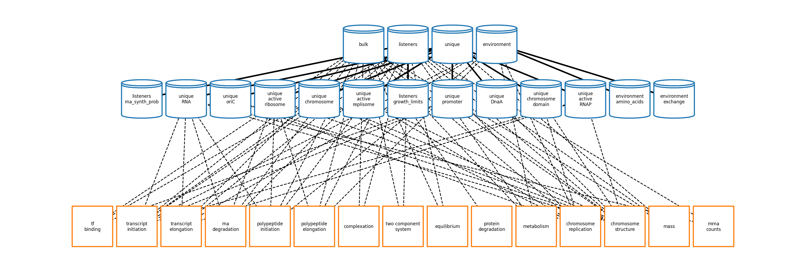

# Model-driven metalloproteomics pinpoints tradeoffs impacting cell growth
## Model parameter adjustments


This section describes how to regenerate the two model-output files used in this study,

`proteins_filtered.tsv` and `complexes_filtered.tsv`.

For this study,  we adjusted 16 parameters relative to the previous version of the model to improve agreement with ribosome profiling data. All of them are listed in
[`reconstruction/ecoli/flat/adjustments/rna_expression_adjustments.tsv`]
(reconstruction/ecoli/flat/adjustments/rna_expression_adjustments.tsv).

To confirm that these adjustments did not substantially alter the behavior of the model, we ran simulations under two variant conditions and compared the resulting protein and complex abundances against the previous version of the model. The instructions below reproduce those simulations and regenerate the comparison files.

## Regenerating `proteins_filtered.tsv` and `complexes_filtered.tsv`

The workflow runs 32 independent lineages ("seeds") for 8 successive generations under each of
two nutrient conditions:

<div align="center">

| Variant | Nutrient condition | Media | Seeds | Generations |
|:-------:|:-------------------|:------|:-----:|:-----------:|
| 0 | Minimal      | `minimal`                   | 32 | 8 |
| 1 | Amino-acid supplemented (rich) | `minimal_plus_amino_acids`  | 32 | 8 |

</div>

Variant 0 is the run in glucose minimal medium. Variant 1 switches the nutrients to `minimal_plus_amino_acids` — the same glucose minimal
base supplemented with all 20 amino acids. Media and condition definitions are in
`reconstruction/ecoli/flat/condition/`.

Each variant produces files `proteins_filtered.tsv` and `complexes_filtered.tsv`, for four output files in total.

1. Follow the **Setup** instructions below to install vEcoli, `uv`, and Nextflow.

2. Open `configs/protein_counts_cofactor_local.json` and change the number of seeds and generations if needed/desired.  Currently, the config runs a single seed for a single generation for quick testing. To reproduce study outputs change the following: 

```json
"n_init_sims": 32,
"generations": 8,
```

**Warning:** 
the full 32 x 8 run writes roughly 240 GB of Parquet output (about 420 MB per simulated cell) and is limited by your hardware in both runtime and disk. 

3. From the top level of the repository, run:

```
uvenv runscripts/workflow.py --config configs/protein_counts_cofactor_local.json
```

This runs the ParCa, then the simulations for both variants, then the analysis that writes the four TSV files.

4. Output is written to a new `out/` directory in the repository. 

`variant=0` holds the minimal-medium results and `variant=1` the amino-acid-supplemented results.

## What the output files contain

Both files are written by
[`ecoli/analysis/multiseed/protein_counts_cofactor.py`](ecoli/analysis/multiseed/protein_counts_cofactor.py) and share the same layout. Both are tab-separated with a single header row.

**Rows.**
One row per simulated cell — that is, one row for each (seed, generation) pair. A
32-seed, 8-generation run gives 256 rows per file. The first two columns are:

| Column | Description |
|:-------|:------------|
| `seed`       | Seed identifying the independent lineage the cell belongs to |
| `generation` | Generation index within that seed |

**Values.** 
Every remaining column is a either a complex or protein count for that cell, averaged over all
simulation timesteps between the cell's intialization and its division. Values are floating point
because they are time averages of integer counts. Counts are raw counts per cell: they are not
normalized to cell volume, cell mass, or total protein, and are not log-transformed. 

**`proteins_filtered.tsv`** 
— 4434 columns after `seed` and `generation`, one per protein
monomer, named by EcoCyc monomer identifier.

**`complexes_filtered.tsv`** 
— 1093 columns after `seed` and `generation`, one per
macromolecular complex, named by EcoCyc complex identifier. 

**What "filtered" means.** 
The simulation tracks tens of thousands of bulk molecules. Each file
is restricted to a curated list of identifiers relevant to this study — the cofactor-binding proteins and complexes analyzed in the paper. Those lists are stored as plain text, one identifier per line, in `ecoli/analysis/multiseed/cofactor_ids/protein_ids.txt` and `ecoli/analysis/multiseed/cofactor_ids/complex_ids.txt`, and column order in the output follows the order in those files. This is a subset operation only: no abundance threshold and no statistical filter is applied. A handful of listed identifiers do not exist in the model's molecule set and are emitted as columns of zeros, so that the column set is identical across
runs and across variants and the two variants can be compared directly.


##
# Vivarium *E. coli*



## Background

Vivarium *E. coli* (vEcoli) is a port of the Covert Lab's 
[E. coli Whole Cell Model](https://github.com/CovertLab/wcEcoli) (wcEcoli)
to the [Vivarium framework](https://github.com/vivarium-collective/vivarium-core).
Its main benefits over the original model are:

1. **Modular processes:** easily add/remove processes that interact with
    existing or new simulation state
2. **Unified configuration:** all configuration happens through JSON files,
    making it easy to run simulations/analyses with different options
3. **Parquet output:** simulation output is in a widely-supported columnar
    file format that enables fast, larger-than-RAM analytics with DuckDB
4. **Google Cloud support:** workflows too large to run on a local machine
    can be easily run on Google Cloud

As in wcEcoli, [raw experimental data](reconstruction/ecoli/flat) is first processed
by the parameter calculator or [ParCa](reconstruction/ecoli/fit_sim_data_1.py) to calculate 
model parameters (e.g. transcription probabilities). These parameters are used to configure
[processes](ecoli/processes) that are linked together into a
[complete simulation](ecoli/experiments/ecoli_master_sim.py).

## Setup

> **Note:** The following instructions assume a local Linux or MacOS system. Windows users can
> attempt to follow the same steps after setting up 
> [Windows Subsystem for Linux](https://learn.microsoft.com/en-us/windows/wsl/install). Refer to the following pages for non-local setups:
> [Sherlock](https://covertlab.github.io/vEcoli/hpc.html#sherlock),
> [other HPC cluster](https://covertlab.github.io/vEcoli/hpc.html#other-clusters),
> [AWS](https://covertlab.github.io/vEcoli/aws.html),
> [Google Cloud](https://covertlab.github.io/vEcoli/gcloud.html).

### Prerequisites

If your system has git, curl (or wget), and a C compiler
(e.g. clang, gcc), proceed to the next section.

On Ubuntu/Debian, apt can be used to install all three prerequisites:

    sudo -s eval 'apt update && apt install -y git curl clang'

On MacOS, curl is preinstalled and git and clang come with the Xcode Command Line Tools:

    xcode-select --install

> **Warning:** If you used Apple's migration wizard to transfer your data from an
> Intel-based (released pre-2020) to a newer Mac, open "System Information" and
> click "Applications" in the left side menu. Sort by "Kind" and look for any "Intel"
> applications. For best performance and compatibility, we recommend uninstalling
> and reinstalling those apps, if possible. You likely will need to do the same for
> any installed developer apps like Homebrew, etc. Lastly, if you see a message in
> your terminal about changing the default shell to zsh, we recommend running the
> listed command to do so ([detailed instructions](https://support.apple.com/en-us/102360)).

### Installation

1. Clone the repository:

```
git clone https://github.com/CovertLab/vEcoli.git
```

> **Tip:** You can specify a directory to clone into after the
> URL of the repository. Otherwise, the above command will clone into
> a new directory called `vEcoli` in your current directory. To speed up
> the clone and save disk space, add `--filter=blob:none` to the command.

2. [Follow these "Standalone installer" instructions](https://docs.astral.sh/uv/getting-started/installation/)
to install `uv`, our Python package and project manager of choice.
   
3. Close and reopen your terminal.

4. Navigate into the cloned repository and use `uv` to install the model:

```
# Navigate into cloned repository ("vEcoli", by default)
cd vEcoli
# Install base and dev dependencies (see pyproject.toml)
uv sync --frozen --extra dev
# Install pre-commit hook that runs ruff linter before every commit
uv run pre-commit install
```

> **Tip:** If uv is not connecting to the venv correctly, or you are running into an error with the 
> `uv run pre-commit install` step, try running `rm -rf .venv` to remove the venv, then run 
> `uv sync --frozen --extra dev` followed by `uv run pre-commit install` to reinstall the venv.

5. Install `nextflow` [following these instructions](https://www.nextflow.io/docs/latest/install.html).
If your system has `wget` but not `curl`, replace `curl` in the commands
with `wget -qO-`. If you choose to install Java with SDKMAN!, after
the Java installation finishes, close and reopen your terminal before
continuing with the `nextflow` installation steps.

> **Tip:** If any step in the `nextflow` installation fails,
> try rerunning a few times to see if that fixes the issue.

6. Navigate back to the cloned repository and add the `uvenv` alias to your shell configuration:

```
# Navigate back to cloned repository ("vEcoli", by default)
cd vEcoli
# Add uvenv alias to shell config (e.g. .bashrc, .zshrc, etc.)
echo -e "\nalias uvenv='uv run --env-file $(pwd)/.env --project $(pwd)'" >> $HOME/.$(basename $SHELL)rc
```

7. Close and reopen your terminal.

8. (optional) For PyCharm integration, follow
[these instructions](https://covertlab.github.io/vEcoli/pycharm.html).
For VS Code integration, select the interpreter located at `.venv/bin/python`
inside the cloned repository following
[these instructions](https://code.visualstudio.com/docs/python/environments#_working-with-python-interpreters).

9. If you are a member of the Covert Lab, ask to be added to the GitHub organization
and [set up SSH authentication](https://docs.github.com/en/authentication/connecting-to-github-with-ssh/generating-a-new-ssh-key-and-adding-it-to-the-ssh-agent).
Then, in a terminal inside your cloned repository, run:

```
git remote set-url origin git@github.com:CovertLab/vEcoli
```

## Test Installation

From the top-level of the cloned repository, run:

    uvenv runscripts/workflow.py --config configs/test_installation.json

Ignore the following warning on macOS:

    WARN: Task runtime metrics are not reported when using macOS without a container engine

> **Note:** Local installations should always use `uvenv` to run scripts instead of `python`. To start
> a Python shell, use `uvenv python` or `uvenv ipython`.

This will run the following basic simulation workflow, saving all output to `out/test_installation`:

1. Run the [parameter calculator](runscripts/parca.py) to generate simulation data.
2. Run the [simulation](ecoli/experiments/ecoli_master_sim.py) for a single generation.
3. [Analyze simulation output](runscripts/analysis.py) by creating a
[mass fraction plot](ecoli/analysis/single/mass_fraction_summary.py).

The percentage displayed for each step only changes when inidividual tasks in
that step complete. For example, the parameter calculator step is a single task,
so its percentage will go from 0 to 100 when it completes.

The full workflow takes about 10 minutes to run on a MacBook Air (2022, M2). If the
Nextflow workflow completes with no errors, navigate to the following folder inside
the cloned repository using a file browser and open `mass_fraction_summary.html` to
inspect the mass fraction summary plot for the simulation you just ran:

    out/test_installation/analyses/variant=0/lineage_seed=0/generation=1/agent_id=0/plots

## Documentation
The documentation is located at [https://covertlab.github.io/vEcoli/](https://covertlab.github.io/vEcoli/)
and contains more information about the model architecture, output,
and workflow configuration.

If you encounter an issue not addressed by the docs, feel free to create a GitHub issue, and we will
get back to you as soon as we can.

## Contributing
External contributions are welcome! Refer to our [Contributor Guide](https://covertlab.github.io/vEcoli/contributing.html) for more details.
