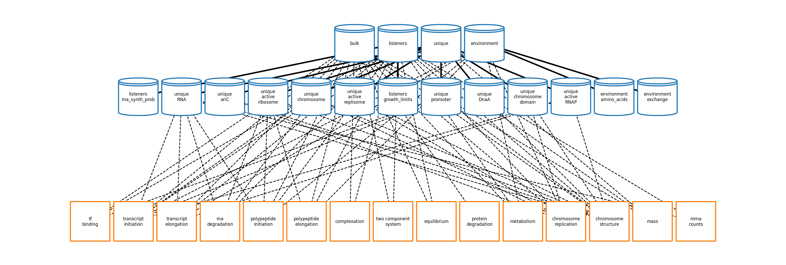

Welcome to Vivarium *E. coli*'s documentation!
==============================================

Vivarium *E. coli* project is a port of the `Covert Lab's *E. coli* Whole Cell Model <https://doi.org/10.1128/ecosalplus.ESP-0001-2020>`_ to the `Vivarium framework <https://vivarium-collective.github.io>`_.

       orange, square nodes on the bottom. The blue nodes are connected
       by solid edges, while the orange nodes are connected to the blue
       nodes by broken edges.

.. toctree::
   :maxdepth: 2

   Processes <reference/processes>
   Composites <reference/composites>
   Experiments <reference/experiments>
   tutorials
   docs
   reference/index

.. note:: Vivarium *E. coli* has not yet been publicly released.

.. WARNING::
   This documentation is very much a work in progress. It likely
   contains errors and poor formatting.

The scope of this project is to migrate the Whole Cell Model's processes, and therefore takes the model's sim_data as its starting point in the simulation pipeline. sim_data is a large configuration object created by the parameter calculator (ParCa). For this reason the ``reconstruction/`` and ``wholecell/utils/`` folders have been duplicated here as they are necessary to unpickle the serialized sim_data object. If a new sim_data object is required to be read, the corresponding wcEcoli folders will have to be synchronized.

All state handling (previously handled by Bulk- and UniqueMolecules states/containers/views) and the actual running of the simulation (previously ``wholecell.sim.Simulation``) are now handled entirely by Vivarium's core engine and process interface.

The new process classes can be found in ``ecoli/processes/*`` and are linked together using a Vivarium topology that is generated in ``ecoli/experiments/ecoli_master_sim.py``.
